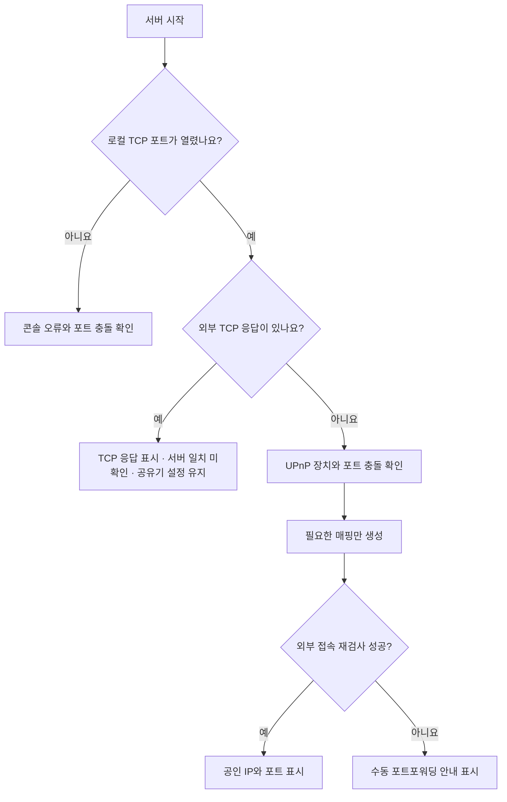

<div align="center">
  
  <h1>MineHarbor — Minecraft Server Launcher</h1>
  <p><strong>복잡한 Java와 네트워크 설정은 줄이고, Windows에서 마인크래프트 서버를 바로 시작하세요.</strong></p>
  <p>서버 생성부터 업데이트, 백업, 콘텐츠, 플레이어, 외부 접속까지 한곳에서 관리하는 데스크톱 런처입니다.</p>

  <p>
    <a href="https://github.com/Mangom72/MineHarbor/releases/latest"></a>
    <a href="https://github.com/Mangom72/MineHarbor/actions/workflows/build-release.yml"></a>
    <a href="LICENSE"></a>
    
  </p>

  <p><a href="#한국어">한국어</a> · <a href="#english">English</a></p>
</div>

---

## 한국어

### 다운로드

| 방식 | 이런 경우에 추천합니다 | 받기 |
| --- | --- | --- |
| **Portable EXE** | 설치 없이 파일 하나로 바로 실행 | **[고정 링크로 다운로드](https://github.com/Mangom72/MineHarbor/releases/latest/download/MineHarbor.exe)** |
| **Windows 설치 프로그램** | 시작 메뉴, 선택적 바탕화면 바로가기, 제거 기능 사용 | **[최신 Release 열기](https://github.com/Mangom72/MineHarbor/releases/latest)** |
| **Portable ZIP** | README와 라이선스를 포함한 묶음 보관 | **[최신 Release 열기](https://github.com/Mangom72/MineHarbor/releases/latest)** |

현재 소스 버전은 `v1.7.0`, 내부 빌드는 `26.2.45.65`입니다. MineHarbor 이름으로 배포된 Portable EXE는 같은 링크에서 계속 최신 파일을 받을 수 있습니다. 기존 설치의 `%LOCALAPPDATA%\MinecraftServerLauncher` 데이터는 자동으로 찾아 그대로 사용하며, 새 사용자 데이터 경로는 `%LOCALAPPDATA%\MineHarbor`입니다.

> [!TIP]
> Paper/Purpur 실시간 명령 브리지는 앱의 `명령·브리지 관리`에서 서버별로 설치할 수 있습니다. 수동 설치 파일과 `SHA256SUMS.txt`는 최신 Release에 함께 제공됩니다.

### 왜 이 런처인가요?

| | |
| --- | --- |
| **빠른 시작**<br>Java, 서버 JAR, 기본 설정을 순서대로 준비합니다. | **버전 호환**<br>서버 종류와 Minecraft 버전에 맞는 Java를 선택합니다. |
| **한곳에서 운영**<br>여러 서버, 백업, 콘텐츠, 플레이어와 콘솔을 함께 관리합니다. | **외부 접속 지원**<br>외부 TCP 응답을 확인하되 서버 일치 여부를 구분하고 필요한 경우에만 UPnP를 시도합니다. |

Paper, Vanilla, Purpur부터 모드 서버까지 지원하면서도 자주 쓰는 기능만 먼저 보여 줍니다. 상세 설정과 진단 도구는 필요할 때 열 수 있고, 한국어·영어 및 다크·라이트 모드를 제공합니다.

### 3단계로 시작하기

1. **[Portable EXE를 내려받아](https://github.com/Mangom72/MineHarbor/releases/latest/download/MineHarbor.exe)** 실행합니다.
2. 데이터 위치와 서버 종류, Minecraft 버전, 프리셋, 메모리를 선택하고 Minecraft EULA에 동의합니다.
3. `서버 시작`을 누른 뒤 화면에 표시된 주소를 친구에게 전달합니다.

메인 창은 먼저 표시되고 업데이트, 프로필, 최신 버전 목록은 백그라운드에서 불러옵니다. Java 준비, 파일 다운로드, 서버 시작, 포트 확인처럼 시간이 걸리는 작업은 현재 단계와 진행률을 화면에 표시합니다.

## 지원 범위

### 서버 종류

| 종류 | 파일 준비 | 버전 선택 | 실시간 명령 브리지 |
| --- | --- | --- | --- |
| Paper | 자동 | 지원 | Paper 1.13 이상에서 선택 사용 |
| Vanilla | 자동 | 지원 | 로컬 자동완성 |
| Purpur | 자동 | 지원 | Purpur 1.13 이상에서 선택 사용 |
| Fabric | 자동 | 지원 | 로컬 자동완성 |
| Forge | 자동 | 지원 | 로컬 자동완성 |
| NeoForge | 자동 | 지원 | 로컬 자동완성 |
| 직접 JAR | 사용자가 지정 | 요구 Java 직접 선택 | 로컬 자동완성 |

스냅샷과 프리릴리즈는 기본적으로 숨기고 사용자가 `스냅샷 포함`을 켰을 때만 표시합니다. 서버 JAR은 EXE에 넣지 않으며, 새 서버를 만들 때 선택한 프로젝트의 공개 API에서 최신 호환 파일을 내려받고 제공된 해시를 검증합니다.

### Java 호환성

Minecraft 및 서버 종류에 맞춰 Java 8·11·16·17·21·25 중 필요한 런타임을 선택합니다. Java는 런처 EXE에 포함하지 않으며, 호환 버전이 없을 때 Eclipse Adoptium에서 한 번만 내려받아 SHA-256을 확인하고 캐시합니다. 직접 JAR은 제작자가 요구하는 Java 주 버전을 사용자가 지정할 수 있습니다.

### 시스템 요구 사항

| 항목 | 요구 사항 |
| --- | --- |
| 운영체제 | Windows 10 또는 Windows 11 x64 |
| 메모리 | 서버 규모에 따라 선택, 기본 추천 4GB |
| 인터넷 | 최초 Java·서버 파일 준비, 업데이트, 콘텐츠 검색, 외부 접속 검사에 필요 |
| 저장 공간 | 서버 파일, 월드, 플러그인·모드와 백업 크기에 따라 달라짐 |

## 핵심 기능

### 서버 생성과 여러 서버 관리

- 평화로움·쉬움·보통·어려움·하드코어 야생 프리셋
- 일반 지형·평지 크리에이티브 월드 프리셋
- 게임 모드, 난이도, PvP, 화이트리스트, 명령 블록, 정품 인증, 거리 설정 직접 편집
- 프로필 생성, 복제, 폴더 가져오기, 이름 변경, 안전 보관과 기본 서버 선택
- 삭제한 서버를 30일간 보관하는 휴지통과 복구·영구 삭제 관리. 휴지통으로 보낼 때만 서버 이름을 입력하고 영구 삭제는 3초 안전 확인 사용
- 프로필별 월드·설정·플러그인·모드 분리
- 같은 포트의 서버를 동시에 실행할 때 확인 후 사용 가능한 포트로 자동 변경
- 서버별 접속 주소와 바로 옆 복사 기호, 외부 접속 실패 시 `접속 불가` 상태 표시
- 관리 도구 창을 열어 둔 상태에서도 메인 창의 상태·콘솔·주소 확인 가능
- 비정상 종료 자동 재시작 및 10분 안에 3번 연속 실패하면 중단

### 업데이트와 백업

- 서버 파일 자동 업데이트 옵션과 수동 `서버 업글`
- 서버 종류·Minecraft 버전 변경 전 호환성 경고와 백업
- 전체 프로필 수동 백업, 보존 개수 설정, 내보내기와 외부 백업 가져오기
- 서버별 정기 백업, 시작 전·종료 후 백업, 예약 시작·종료·재시작·명령 실행
- 예약 재시작 전 플레이어 공지, 다음 실행 시각과 최근 결과, 개수·기간·총용량 백업 보존 정책
- 일정은 MineHarbor 관리 창이 실행 중일 때 평가되며 별도 Windows 백그라운드 서비스는 설치하지 않음
- SHA-256 무결성 확인과 임시 폴더 검증 후 안전 복원
- 설정 변경 전 `server.properties` 백업
- 사용자 승인 후에만 실행되는 런처 자동 업데이트와 실패 시 이전 EXE 복원
- 언어 변경 옆 `런처 업데이트` 버튼을 통한 즉시 재검사와 선택한 버전의 알림 숨기기

> [!WARNING]
> 최신 버전에서 생성한 월드를 구버전 서버로 열면 월드가 손상될 수 있습니다. 런처는 위험한 다운그레이드를 차단하지만, 중요한 월드는 별도 장치에도 백업해 두는 것을 권장합니다.

### 콘텐츠, 플레이어와 콘솔

- 설치된 플러그인·모드·데이터팩을 MineHarbor 관리 파일과 수동 설치 파일로 구분
- 개별·일괄 업데이트 확인, 활성화·비활성화, 복구 가능한 제거와 서버별 manifest 저장
- 콘텐츠 첫 화면에 인기 플러그인·모드 표시
- 선택한 콘텐츠의 아이콘, 제작자, 다운로드 수와 설명 제공
- 현재 버전과 로더에 맞는 Modrinth 플러그인·모드·데이터팩 검색
- Modrinth 필수 의존성·순환 의존성, Minecraft 버전·로더 호환성 검사
- 선택한 월드의 `world/datapacks`에 설치하고 루트 `pack.mcmeta`, 압축 경로·크기를 검증
- 다운로드 크기와 SHA-512/SHA-1 검증 후 설치, 기존 파일 자동 백업
- 온라인 플레이어 이름 자동완성을 지원하는 화이트리스트, OP·DEOP, 추방, 차단·해제 플레이어 관리
- 검색, 줄 바꿈, 일반 경고·호환성·오류를 구분하는 콘솔 필터
- 읽던 위치를 유지하고 맨 아래를 볼 때만 새 로그를 따라가는 콘솔
- 개인정보를 가린 로그·설정·크래시 보고서 진단 묶음
- 다크·라이트 테마에 맞춘 둥근 드롭다운, 체크박스, 탭, 목록 구분선과 필요한 경우에만 나타나는 스크롤

### 서버 대시보드

- 서버 상태·가동 시간, Java 프로세스 CPU·메모리와 Java 버전
- 온라인 플레이어, 서버·월드·백업 용량, 최근 경고·오류와 다음 예약 작업
- 실제 외부 접속 검사 결과를 표시하며 확인되지 않은 상태를 성공으로 추정하지 않음
- Paper/Purpur 명령 브리지 연결 시 공개 서버 API에서 받은 TPS 1·5·15분 값과 MSPT 표시
- 브리지 미지원·연결 해제·권한 부족·서버 종료 상태는 임의 값 대신 명시적인 지원 불가 상태로 표시

### 빠른 명령과 자동완성

빠른 명령은 `카테고리 → 기능 → 명령` 구조로 정리됩니다. 예를 들어 `월드 → 난이도 → 어려움`, `월드 → 날씨 → 맑음`처럼 찾을 수 있으며 이름, 설명, 경로와 실제 명령어를 한 번에 검색합니다.

- `Ctrl+F`, 방향키, `Enter`, `Esc`로 명령 선택창 조작
- 커서 위치와 따옴표를 이해하는 자동완성, `Tab`으로 후보 적용
- `Tab`·`Shift+Tab`으로 자동완성 후보 순환, `Enter`로 선택한 명령 전송
- `Ctrl+Space`로 후보 다시 열기, `Ctrl+↑`·`Ctrl+↓`로 명령 기록 탐색
- 멀티 서버 콘솔에서 기본 명령과 온라인 플레이어 이름 자동완성
- 온라인 플레이어, 게임 모드, 난이도, 아이템, 좌표 등을 받는 사용자 명령 템플릿
- 위험하거나 권한을 바꾸는 명령은 전송 전에 확인
- Paper/Purpur 브리지 연결 시 `플러그인 → 플러그인 이름 → 명령어`로 실시간 분류

사용자 명령은 데이터 루트의 `config/quick-commands.json`에 별도로 저장되어 런처 업데이트 후에도 유지됩니다. 브리지는 실행할 때마다 만든 무작위 토큰과 임시 포트로 `127.0.0.1`에만 연결하며, 실제 명령 실행은 기존 콘솔 입력 경로를 사용합니다.

## 외부 접속

런처는 이미 잘 작동하는 공유기 설정을 우선 사용하며 함부로 바꾸지 않습니다.



- 일반 외부 검사는 TCP 포트가 열렸는지만 알 수 있으므로 Minecraft 서버 일치 여부를 확정하지 않습니다. 응답이 있으면 후보 주소와 `서버 일치 미확인`을 함께 표시하고 공유기 설정은 변경하지 않습니다.
- MineHarbor가 만든 UPnP 매핑을 다시 검사해 응답한 경우에만 대시보드에 `확인됨`으로 표시합니다.
- 다른 내부 PC가 같은 외부 포트를 사용하면 덮어쓰지 않고 충돌로 알립니다.
- 기본 TCP 매핑과 Minecraft Query 사용 시 필요한 UDP 매핑만 시도합니다.
- 서버가 끝나면 현재 런처 세션이 만들고 기록과 정확히 일치하는 매핑만 삭제합니다.
- 최종 실패 시 내부 IPv4, 기본 게이트웨이, 포트, 공유기 관리 주소, 방화벽 및 이중 NAT·CGNAT 가능성을 안내합니다.
- 외부 검사 서비스 자체가 응답하지 않으면 접속 실패로 단정하거나 UPnP를 실행하지 않습니다.

## 데이터와 개인정보

최초 실행에서 다음 중 하나를 선택할 수 있습니다.

| 데이터 위치 | 경로 |
| --- | --- |
| 사용자 데이터 | `%LOCALAPPDATA%\MineHarbor` |
| Portable 데이터 | EXE 옆의 `Minecraft-Servers-Data` |
| 사용자 지정 | 쓰기 가능하고 시스템 폴더가 아닌 선택 경로 |

기존 `Minecraft-Servers-Data`를 찾으면 우선 제안하지만 자동으로 이동·삭제·덮어쓰지 않습니다. 이전 제품 이름으로 만든 `%LOCALAPPDATA%\MinecraftServerLauncher`가 있으면 새 폴더를 강제로 만들지 않고 기존 서버 데이터를 계속 사용합니다. 각 서버는 `servers\<프로필 이름>` 아래에서 월드와 설정을 분리해 보관합니다.

런처는 사용 통계나 분석 정보를 수집하지 않으며 로그와 진단 묶음을 자동 전송하지 않습니다. 진단 묶음은 사용자가 직접 만들고 공유할 때만 PC 밖으로 나갑니다. 자세한 네트워크 사용처와 가림 항목은 [개인정보 처리 안내](PRIVACY.md)에서 확인할 수 있습니다.

## 안전하게 설계된 부분

- Java, 서버 파일, 콘텐츠, 브리지와 런처 업데이트의 크기·해시 검증
- 기존 포트포워딩과 다른 기기의 UPnP 매핑을 덮어쓰지 않음
- 자동 OP는 정품 계정 인증이 켜졌을 때만 동작해 닉네임 사칭 위험 완화
- 브리지의 루프백 전용 통신, 실행별 임시 토큰과 외부 포트 미사용
- 진단 묶음에서 사용자 경로, IP, 서버 소유자, RCON 비밀번호 등 제거
- 복원·업데이트 실패 시 기존 데이터 또는 실행 파일로 되돌리기

## 문제 해결

| 증상 | 먼저 확인할 내용 |
| --- | --- |
| 서버가 바로 종료됨 | `콘솔 열기`에서 첫 오류를 확인하고 진단 요약을 살펴보세요. |
| 친구가 접속하지 못함 | 로컬 포트, Windows 방화벽, 포트포워딩, 공인 IP와 이중 NAT·CGNAT 안내를 확인하세요. |
| `Advanced terminal features...` 또는 `sun.misc.Unsafe` 경고가 보임 | 리디렉션된 GUI 콘솔이나 Java 라이브러리의 호환성 경고일 수 있습니다. 서버 실패와 구분되는 `호환성` 필터로 확인하세요. |
| 구버전 Paper가 도움말 또는 Java 에이전트 오류 후 종료됨 | 최신 런처로 갱신한 뒤 다시 시작하세요. 런처는 구버전에 맞는 실행 인수와 상대 JAR 경로를 사용합니다. |
| 서버 종류나 버전을 바꾼 뒤 오류가 발생함 | 플러그인·모드 호환성을 확인하고 필요하면 백업에서 복원하세요. |
| 서버 소유자 자동 OP가 동작하지 않음 | 정품 계정 인증과 닉네임 철자를 확인하세요. |
| 실시간 명령이 로컬 상태로만 표시됨 | Paper/Purpur 1.13 이상인지 확인하고 서버를 끈 뒤 `명령·브리지 관리`에서 설치 상태를 확인하세요. |
| 자동 업데이트나 콘텐츠 설치가 실패함 | 인터넷 연결, 보안 프로그램과 해당 프로젝트 API 접속 여부를 확인하세요. |

문제가 계속되면 민감 정보를 가린 `진단 묶음`을 만든 뒤 [GitHub Issues](https://github.com/Mangom72/MineHarbor/issues)에 증상과 재현 순서를 남겨 주세요. 보안 문제는 공개 이슈 대신 [보안 정책](SECURITY.md)의 방법으로 알려 주세요.

## 개발과 기여

Windows 10/11 x64, PowerShell 5.1 이상과 .NET Framework 4.x C# 컴파일러가 필요합니다. .NET 10 SDK가 있으면 SDK 스타일 `MineHarbor.csproj`의 `net48` 호환 빌드도 함께 확인할 수 있습니다.

```powershell
.\scripts\Prepare-BuildResources.ps1
.\build.ps1
.\test.ps1
dotnet build .\MineHarbor.csproj -c Release
```

설치 프로그램 빌드는 Inno Setup 6.7 이상이 필요합니다. 릴리스 워크플로는 Portable EXE·ZIP, 설치 프로그램, Paper/Purpur 명령 브리지, `SHA256SUMS.txt`와 `update.json`을 만듭니다. 빌드 원칙과 테스트 방법은 [CONTRIBUTING.md](CONTRIBUTING.md)를 확인해 주세요.

## 프로젝트 문서

- [변경 기록](CHANGELOG.md)
- [기여 안내](CONTRIBUTING.md)
- [개인정보 처리 안내](PRIVACY.md)
- [보안 정책](SECURITY.md)
- [.NET 현대화 검토](docs/architecture/DOTNET_MODERNIZATION.md)
- [MIT License](LICENSE)

---

## English

### Download

| Package | Best for | Link |
| --- | --- | --- |
| **Portable EXE** | Run one file without installation | **[Download from the permanent URL](https://github.com/Mangom72/MineHarbor/releases/latest/download/MineHarbor.exe)** |
| **Windows installer** | Start Menu, optional desktop shortcut, and uninstall support | **[Open the latest release](https://github.com/Mangom72/MineHarbor/releases/latest)** |
| **Portable ZIP** | Keep the launcher, README, and license together | **[Open the latest release](https://github.com/Mangom72/MineHarbor/releases/latest)** |

Current source version: `v1.7.0` · internal build: `26.2.45.65`. MineHarbor releases keep the same permanent Portable URL. Existing data under `%LOCALAPPDATA%\MinecraftServerLauncher` is detected and preserved; new user-data installations use `%LOCALAPPDATA%\MineHarbor`.

### Minecraft servers without the setup maze

MineHarbor — Minecraft Server Launcher is a Windows desktop app for creating and operating Paper, Vanilla, Purpur, Fabric, Forge, NeoForge, and custom-JAR servers. It prepares a compatible Java runtime, downloads and verifies server files, keeps profiles isolated, manages backups and content, and helps make a server reachable from outside your network.

| | |
| --- | --- |
| **Start quickly**<br>Java, server JARs, and first-run settings are prepared in order. | **Stay compatible**<br>Java 8/11/16/17/21/25 is selected for the chosen server and Minecraft version. |
| **Operate in one place**<br>Manage multiple servers, backups, content, players, and consoles. | **Connect safely**<br>External TCP responses are reported separately from server identity; UPnP is attempted only after a confirmed closed-port result. |

### Quick start

1. **[Download the Portable EXE](https://github.com/Mangom72/MineHarbor/releases/latest/download/MineHarbor.exe)** and run it.
2. Choose a data location, server type, Minecraft version, preset, and memory, then accept the Minecraft EULA.
3. Press `Start server` and share the address shown by the launcher.

The main window appears first while update, profile, and current version data load in the background. Long operations report their current stage and progress.

## Highlights

- **Server profiles:** create, clone, import, rename, archive, select, run, and safely stop isolated servers; port conflicts can be reassigned after confirmation, and each address has a one-click copy action.
- **Presets and settings:** survival difficulties, hardcore, normal or flat creative worlds, plus GUI controls for common `server.properties` options.
- **Compatible runtimes:** automatic Java 8/11/16/17/21/25 selection and download; explicit Java selection for custom JARs.
- **Updates and backups:** optional server auto-update, manual upgrades, staged profile restore, SHA-256 verification, export, scheduled or start/stop-hook backups, and count/day/size retention.
- **Scheduling:** per-server backup, start, stop, restart, and command jobs with player warnings, execution leases, next-run times, and latest results.
- **Scheduling scope:** jobs are evaluated while a MineHarbor management window is running; this release does not install a separate Windows background service.
- **Content:** installed plugin/mod/data-pack inventory, managed/manual distinction, compatibility and dependency checks, individual or batch updates, enable/disable/remove, verified Modrinth search, and world-targeted data-pack installation.
- **Dashboard:** status, uptime, Java CPU/memory/version, players, storage, warnings/errors, verified external access, next schedule, and bridge-provided TPS/MSPT without guessed values.
- **Operations:** online-player autocomplete for whitelist, OP, kick and ban controls; searchable consoles, managed-server command/player suggestions, and separate warning, compatibility, and error filters.
- **Diagnostics:** common startup-cause summaries and exportable bundles with paths, IP addresses, owner names, and secrets redacted.
- **Interface:** Korean/English, dark/light themes, modern dropdowns, checkboxes, tabs and list surfaces, responsive windows, restrained scrolling, concise tooltips, background loading, and visible progress.

## Quick commands and live suggestions

Commands are organized as `Category → Function → Command`, such as `World → Difficulty → Hard` or `World → Weather → Clear`. Search matches display names, descriptions, hierarchy paths, and command text. The picker supports Ctrl+F, arrow keys, Enter, and Esc.

Cursor-aware suggestions, history, and editable templates work locally for every server type. When the optional Paper/Purpur bridge is connected, registered plugin commands also appear under `Plugins → Plugin name → Command`. Destructive and privilege-changing commands require confirmation.

The player-management field suggests connected player names, and managed-server consoles suggest common commands plus player arguments. Use Up/Down and Tab or Enter without leaving the keyboard.

The bridge binds only to `127.0.0.1`, uses a new random token and temporary port per run, opens no external port, and leaves command execution on the existing console-input path. User templates remain separate in `config/quick-commands.json` across launcher updates.

## External access flow

The launcher checks the local TCP listener and current external TCP reachability before touching UPnP. A generic port check cannot prove that the responding service is this Minecraft server, so an open result is shown as `server identity unverified` and router settings are left unchanged. After a confirmed closed-port result, it discovers UPnP, detects collisions, creates only the required TCP mapping and optional Query UDP mapping, then tests again. Only a successful post-check of a mapping created by MineHarbor is shown as verified.

If access still fails, the manual guide shows the PC IPv4 address, default gateway, internal and external ports, router page, firewall status, and possible double NAT or CGNAT. On shutdown, only mappings created by the current launcher session and still matching its exact record are removed. An unavailable external check service is not treated as a closed port and does not trigger UPnP.

## Data, privacy, and safety

Choose user data (`%LOCALAPPDATA%\MineHarbor`), Portable data (`Minecraft-Servers-Data` beside the EXE), or a writable custom folder. Existing data under the legacy `%LOCALAPPDATA%\MinecraftServerLauncher` path is detected and reused without automatic moves, deletion, or overwrites.

The launcher collects no analytics or usage telemetry and never uploads logs or diagnostic bundles automatically. Downloads are checked by size and available hashes; existing router mappings are preserved; diagnostic bundles redact sensitive values; and automatic owner OP is disabled when online authentication is off. See the [privacy notice](PRIVACY.md) and [security policy](SECURITY.md) for details.

## Build and test

Build on Windows 10/11 x64 with PowerShell 5.1 or newer and the .NET Framework 4.x C# compiler.

```powershell
.\scripts\Prepare-BuildResources.ps1
.\build.ps1
.\test.ps1
```

Installer builds require Inno Setup 6.7 or newer. See [CONTRIBUTING.md](CONTRIBUTING.md) for build rules, tests, and the release workflow.

## Support and policies

- [Latest release](https://github.com/Mangom72/MineHarbor/releases/latest)
- [Changelog](CHANGELOG.md)
- [Contributing](CONTRIBUTING.md)
- [Privacy](PRIVACY.md)
- [Security](SECURITY.md)
- [MIT License](LICENSE)
